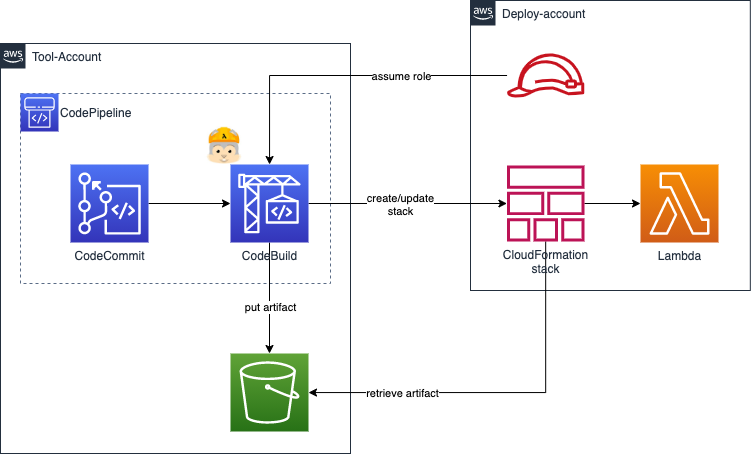

# 개요
* cross account java 예제

# 아키텍처

# 준비
* mvn 설치
* sam 설치
* aws cli 설치 및 aws configure 설정

# 실행방법
* sam build 실행 -> 잘 실행되면 .aws-sam디렉터리가 생성

* sam deploy 실행 -> aws에 배포(apigateway, lambda, role)

# 참고자료
* aws java lmabda 공식문서: https://docs.aws.amazon.com/ko_kr/lambda/latest/dg/java-samples.html
* aws firehose와 lmabda 연동 공식문서: https://docs.aws.amazon.com/ko_kr/lambda/latest/dg/with-kinesis.html
* cross account deploy: https://medium.com/claranet-italia/a-practical-guide-to-surviving-aws-sam-2249f9475055
* lambda sam example: https://github.com/aws-samples/aws-sam-java-rest