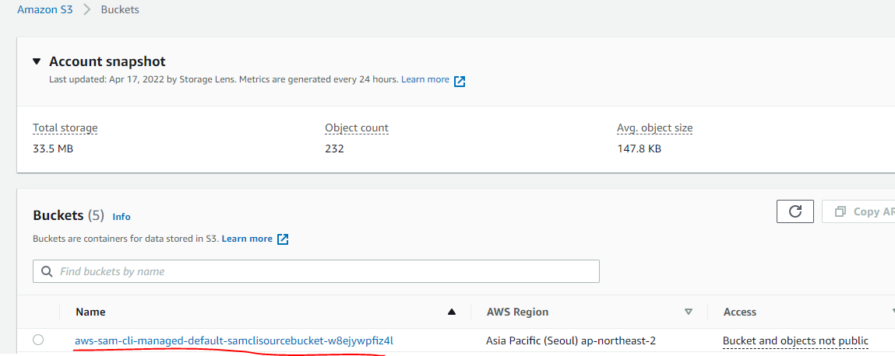

# 개요
* sam deploy 상세내용

# sam이란?
* sam은 cloudformation을 간단하게 사용하기 위한 문법이다. 그러므로 sam실행과정은 cloudformation동작과 동일하다.
* s3에 sam build결과물이 저장되고 cloudforatmion이 s3에 있는 결과물 내용대로 aws 리소스를 배포한다.
* 아래 그림은 sam build이후에 생성된 s3버킷이다.


* 아래 그림은 sam build이후에 생성된 cloudformation이다.


# 이미 존재하는 aws리소스 대상으로 sam으로 덮어쓰기 할때
* 오류 발생


# sam 명령어 
* 이미 존재하는 버킷으로 sam build결과를 저장하려면 --s3-bucket 인자를 설정한다.
```sh
sam deploy --s3-bucket <bucket이름>
```